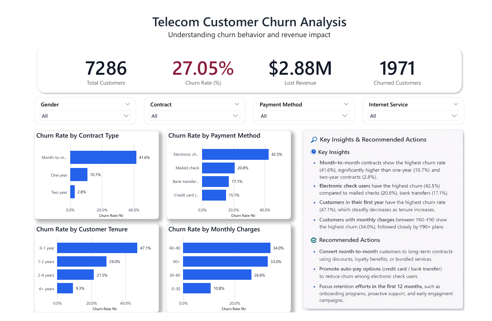

# 📊 Customer Churn Analysis & Retention Intelligence System

## 🚀 Project Overview
Customer churn is one of the biggest challenges for subscription-based businesses.  
When customers leave, businesses lose revenue, growth opportunities, and long-term value.

This project focuses on solving a **real-world business problem**:

> **Why are customers leaving, who is most at risk, and how can businesses reduce churn before it happens?**

The solution combines data analysis, business intelligence, and predictive insights to support **better retention decisions**.

---

## 🔗 Live Project Links

- 🌐 **Live Portfolio Website:** https://auronex-portfolio.vercel.app   
- 📁 **GitHub Repository:** https://github.com/axaymathukiya27-tech/Customer-Churn-Analysis


## 🎯 Business Problems Solved

This project answers critical business questions such as:

- Which customers are most likely to churn?
- What are the key factors driving customer churn?
- Which customer segments are at high risk?
- How much revenue is being lost due to churn?
- Which services and payment methods impact retention?
- How does customer behavior change over time?

---

## 💡 Key Outcomes & Insights

✔ Identified high-risk customer segments  
✔ Discovered major churn drivers affecting retention  
✔ Built a churn prediction system  
✔ Estimated revenue loss due to churn  
✔ Performed cohort, RFM, and CLV analysis  
✔ Created an interactive Power BI dashboard for decision-making  

---

## 🧠 What I Did (Simple Explanation)

### 1️⃣ Data Understanding & Cleaning
- Cleaned and prepared raw customer data
- Handled missing values and inconsistencies
- Ensured reliable data for analysis

### 2️⃣ Customer Behavior Analysis
- Analyzed customer usage and subscription patterns
- Identified churn trends across tenure, services, and payment methods
- Performed retention and cohort analysis

### 3️⃣ Churn Prediction
- Built multiple churn prediction models
- Compared model performance
- Selected the best-performing model for churn risk identification

### 4️⃣ Business-Focused SQL Analysis
- Customer segmentation
- Churn driver analysis
- Revenue loss estimation
- High-risk customer identification

### 5️⃣ Dashboard & Reporting
- Designed a Power BI dashboard for business users
- Created clear and easy-to-understand visualizations
- Delivered actionable insights for decision-making

---

## 📊 Dashboard Preview (Power BI)

The interactive Power BI dashboard provides a clear view of customer churn behavior and revenue impact.



### Dashboard Highlights:
- Overall churn rate and customer count
- High-risk customer segments
- Revenue loss due to churn
- Churn by contract type, tenure, and services
- Retention opportunities for business action


---

## 🗂️ Project Structure (Simplified)
```bash
Customer-Churn-Analysis/
│
├── data/ → Raw and cleaned customer data
├── notebooks/ → Step-by-step analysis
├── models/ → Trained churn prediction models
├── sql/ → Business and retention analysis queries
├── power bi/ → Interactive Power BI dashboard
├── reports/ → Charts, metrics, and summaries
├── docs/ → Case study and documentation
└── src/ → Reusable analysis code
```

---

## 🖼️ Project Architecture
```bash
Customer Data
↓
Data Cleaning & Preparation
↓
Customer Analysis (SQL + Python)
↓
Churn Prediction Models
↓
Business Insights
↓
Power BI Dashboard
↓
Decision Making & Retention Strategy
```


This architecture represents a complete end-to-end solution, starting from raw customer data and ending with actionable business decisions.

---

## 👥 Who Can Benefit from This?

This solution is useful for:
- Subscription-based businesses
- Telecom and SaaS companies
- E-commerce platforms
- Startups focused on customer retention
- Marketing and growth teams

---

## 🧩 Business Value Delivered

✅ Reduced customer churn risk  
✅ Improved customer retention strategies  
✅ Increased customer lifetime value  
✅ Prevented revenue loss  
✅ Enabled data-driven decision-making  

---

## 📬 Let’s Work Together

If you are looking to:
- Understand why customers are leaving
- Predict churn before it happens
- Improve customer retention strategies

Feel free to reach out — I’d be happy to help.

---
## 👤 Author

**Axay Mathukiya**  
Data Analyst | Data Science Enthusiast  

- 🌐 Live Portfolio Website: https://auronex-portfolio.vercel.app  
- 💻 GitHub: https://github.com/axaymathukiya27-tech  
- 💼 LinkedIn: https://www.linkedin.com/in/axay-mathukiya-a6989b308/


## ⭐ Final Note
This project focuses on **business impact**, not just technical complexity.  
All insights are designed to be clear, actionable, and easy to understand for non-technical stakeholders.
